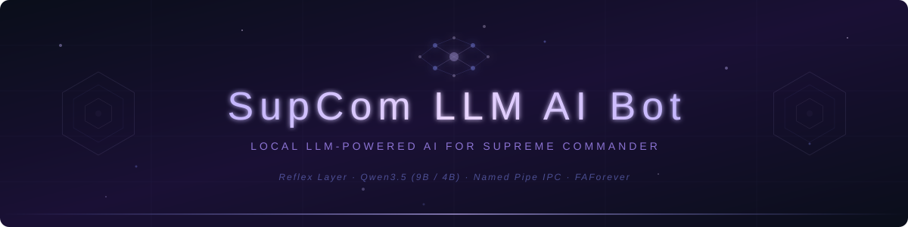

<div align="center">

<!-- Banner -->


# SupCom LLM AI Bot

*«Лучшая стратегия — та, которую враг не ожидал.»*

**Локальная LLM-управляемая ИИ для Supreme Commander: Forged Alliance через [FAForever](https://www.faforever.com/)**

[](https://python.org)
[](https://huggingface.co/Qwen)
[-6366F1?style=for-the-badge&logo=cplusplus&logoColor=white)]()
[-000080?style=for-the-badge&logo=lua&logoColor=white)]()
[](LICENSE)

[Быстрый старт](#-быстрый-старт) · [Архитектура](#-архитектура) · [Reflex Layer](#-reflex-layer) · [LLM Pipeline](#-llm-decision-pipeline) · [DLL Bridge](#-dll-bridge)

</div>

---

## ✦ О проекте

Трёхслойная ИИ-система, которая полностью работает на вашей машине — без облачных API, без интернета во время игры. Бот играет за UEF (союзник), принимая стратегические решения через комбинацию мгновенных рефлексов и LLM-рассуждений.

<table>
<tr>
<td width="50%">

**Три слоя принятия решений**
- **Reflex** — чистый Lua, < 1с, мгновенные угрозы
- **Fast LLM** — Qwen3.5-4B, ~3-5с, рутинные решения
- **Deep LLM** — Qwen3.5-9B, ~7-10с, стратегические решения

</td>
<td width="50%">

**Ключевые особенности**
- Никаких облаков — всё локально через Ollama
- Named Pipe IPC с lock-free очередями
- DLL-инъекция с thread-safe `lua_sethook`
- Rule-based fallback при недоступности LLM
- Debug overlay (Ctrl+Shift+D) в игре

</td>
</tr>
</table>

---

## ✦ Архитектура

```
    SupCom:FA (32-bit)                    Python Bridge Server
    ┌─────────────────────┐               ┌───────────────────────┐
    │  Lua AI Brain       │   Named       │  State Processor      │
    │  ┌───────────────┐  │   Pipe        │  ┌─────────────────┐  │
    │  │ GameState     │──┼───(IPC)──────>│  │ Prompt Builder  │  │
    │  │ Collector     │  │               │  └────────┬────────┘  │
    │  └───────────────┘  │               │           │           │
    │                     │               │  ┌────────▼────────┐  │
    │  ┌───────────────┐  │               │  │   LLM Router    │  │
    │  │ Strategy   <──┼──┼───(IPC)──────<│  │  4B fast / 9B   │──┼──> Ollama
    │  │ Executor      │  │               │  └────────┬────────┘  │   (local)
    │  └───────────────┘  │               │           │           │
    │                     │               │  ┌────────▼────────┐  │
    │  ┌───────────────┐  │               │  │ Command Builder │  │
    │  │ Reflex Layer  │  │  (no LLM)     │  │ + Fallback      │  │
    │  │ < 1s response │  │               │  └─────────────────┘  │
    │  └───────────────┘  │               │                       │
    └─────────────────────┘               └───────────────────────┘
```

**IPC**: Windows Named Pipe `\\.\pipe\supcom_llm_bridge` — 4-byte LE length-prefix + UTF-8 JSON.

---

## ✦ Reflex Layer

Чистый Lua — мгновенная реакция без LLM:

| Условие | Действие | Кулдаун |
|:--------|:---------|:--------|
| Воздушная угроза базы > 15 | Поднять перехватчики | 20 тиков |
| Угроза базе > 30 | Отправить наземную поддержку | 20 тиков |
| Армия теряется быстро (< 60%) | Подкрепление | 20 тиков |
| Союзник столлит масс + свой > 300 | Поделиться массой | 20 тиков |

Кулдауны по сложности: easy=40, normal=20, hard=5 тиков.

---

## ✦ LLM Decision Pipeline

```
    GameStateCollector          StateProcessor          LLMRouter
    ┌──────────────┐           ┌──────────────┐       ┌──────────────┐
    │  Resources   │           │  Structured  │       │  Trigger     │
    │  Units       │──────────>│  Prompt +    │──────>│  Severity    │
    │  Threats     │           │  Game Context│       │  → 4B / 9B   │
    │  Map Control │           └──────────────┘       └──────┬───────┘
    └──────────────┘                                         │
                                                             ▼
    StrategyExecutor           CommandBuilder          Ollama API
    ┌──────────────┐           ┌──────────────┐       ┌──────────────┐
    │  Decision →  │<──────────│  Validate    │<──────│  think: false│
    │  Game Cmds   │           │  JSON schema │       │  Qwen3.5     │
    └──────────────┘           └──────────────┘       └──────────────┘
```

**Fallback**: после 3 таймаутов 9B весь трафик автоматически маршрутизируется на 4B. При полной недоступности LLM — rule-based стратегия.

---

## ✦ DLL Bridge

C++ DLL соединяет 32-bit Lua 5.0 VM движка SupCom и Python-сервер:

| Характеристика | Реализация |
|:---------------|:-----------|
| **Зависимости** | Только KERNEL32.dll + msvcrt.dll |
| **Thread Safety** | `lua_sethook` — хук срабатывает в потоке FA |
| **IPC** | `InterlockedExchange`-based lock-free очереди |
| **Lua API** | Direct function pointers к абсолютным адресам FA |
| **Инъекция** | `CreateRemoteThread` + `LoadLibraryA` через inject.exe |

```cpp
// lua_api_direct.h — вызовы Lua C API через указатели на адреса FA
static inline void lua_pushstring(lua_State* L, const char* s) {
    typedef void (*fn_t)(lua_State*, const char*);
    ((fn_t)0x90cdf0)(L, s);  // FA address, no ASLR (2007 game)
}
```

---

## ✦ Структура проекта

```
AI_For_Supreme_Com/
├── bridge/                        # C++ DLL — game <-> Python
│   ├── src/
│   │   ├── pipe_client.cpp        #   Named Pipe (pure Win32 API)
│   │   ├── lua_bridge.cpp         #   LLMBridge.* регистрация
│   │   ├── lua_injector.cpp       #   Thread-safe lua_sethook
│   │   └── lua_api_direct.h       #   Direct fn-ptr к адресам FA
│   ├── inject.c                   #   32-bit DLL инжектор
│   └── CMakeLists.txt             #   MinGW GCC i686
│
├── server/                        # Python asyncio bridge
│   ├── bridge_server.py           #   Entry point + process watcher
│   ├── llm_client.py              #   Ollama HTTP (think: false)
│   ├── llm_router.py              #   Роутинг 4B / 9B
│   ├── state_processor.py         #   Game state -> prompt
│   ├── command_builder.py         #   LLM response -> commands
│   └── fallback_strategy.py       #   Rule-based fallback
│
├── mod/                           # FAF SIM мод
│   ├── lua/AI/
│   │   ├── LLMAIBrain.lua         #   Главный мозг + потоки
│   │   ├── LLMBridge.lua          #   DLL wrapper + offline mode
│   │   ├── GameStateCollector.lua  #   Сбор игрового состояния
│   │   ├── StrategyExecutor.lua   #   Решения -> команды
│   │   ├── ReflexLayer.lua        #   Мгновенные рефлексы
│   │   ├── EconomyManager.lua     #   Экономика / инженеры
│   │   └── JSON.lua               #   Lua 5.0 JSON codec
│   └── hook/lua/                  #   FAF hooks
│
├── mod-ui/                        # FAF UI мод (lobby dropdown)
├── installer/                     # Скрипты установки
├── tests/                         # Unit + integration тесты
└── specs/                         # Спецификации и контракты
```

---

## ✦ Требования

| Компонент | Версия | Примечание |
|:----------|:-------|:-----------|
| **Python** | 3.12+ | Bridge server |
| **Ollama** | latest | Локальный LLM inference |
| **MSYS2 MinGW32** | GCC i686 | DLL компиляция (SupCom — 32-bit) |
| **FAForever** | latest | Игровой клиент |
| **SupCom: FA** | Steam | Базовая игра |
| **VRAM** | 6+ GB | Для Qwen3.5-9B (Q4_K_M) |

### LLM модели

| Тег | Размер | VRAM | Назначение |
|:----|:-------|:-----|:-----------|
| `qwen3.5:9b` | Q4_K_M | ~5.5 GB | Глубокие стратегические решения |
| `qwen3.5:4b` | Q4_K_M | ~2.5 GB | Быстрые рутинные решения |

---

## ✦ Быстрый старт

### 1. Установка моделей

```bash
ollama pull qwen3.5:9b
ollama pull qwen3.5:4b
```

### 2. Сборка DLL

```bash
# В MSYS2 MinGW32 shell:
cd bridge
cmake -B build_cmake -G "MinGW Makefiles" -DCMAKE_BUILD_TYPE=Release
cmake --build build_cmake
# Output: bridge/build/supcom_llm_bridge.dll
```

### 3. Установка мода

```powershell
# Guided installer:
powershell -File installer/install.ps1

# Или вручную:
Copy-Item -Recurse mod/* "C:\FAFData\mods\supcom-llm-ai-bot\"
Copy-Item -Recurse mod-ui/* "C:\FAFData\mods\supcom-llm-ai-bot-ui\"
Copy-Item bridge\build\supcom_llm_bridge.dll "C:\ProgramData\FAForever\bin\llm_bridge.dll"
Copy-Item bridge\build\inject.exe "C:\ProgramData\FAForever\bin\inject.exe"
```

### 4. Запуск

```powershell
# Terminal 1 — Ollama:
ollama serve

# Terminal 2 — Bridge server:
python server/bridge_server.py --config installer/config.json

# Terminal 3 — FAF: включить оба мода, добавить "LLM AI Bot (UEF)", играть!
```

---

## ✦ Отладка

| Лог | Путь |
|:----|:-----|
| **Decision log** | `%ProgramData%\FAForever\logs\llm_ai_decisions.log` |
| **Injection log** | `%ProgramData%\FAForever\logs\llm_inject.log` |
| **Game log** | `%APPDATA%\Forged Alliance Forever\logs\game_*.log` |
| **In-game overlay** | `Ctrl+Shift+D` (UI мод) |

---

## ✦ Ограничения движка

| Ограничение | Решение |
|:------------|:--------|
| **Lua 5.0** — нет `#`, нет `goto` | `table.getn()`, `table.insert()`, `continue` |
| **32-bit DLL** — только MinGW i686 | CMakeLists + `-m32` flags |
| **ASCII paths** — движок 2007 года | `C:\FAFData` вместо Документов |
| **No ASLR** — фиксированные адреса | Direct fn-ptr в `lua_api_direct.h` |
| **Qwen3.5 thinking** | `"think": false` в Ollama API |

---

## ✦ Разработка

```bash
# Тесты
uv run pytest -v

# Линтер
uv run ruff check .
uv run ruff format .
```

---

## ✦ Лицензия

[MIT License](LICENSE) — свободно используйте, форкайте, дорабатывайте.

---

<div align="center">

<br>

**Сухацкий Максим** · МГТУ им. Н.Э. Баумана (Калужский филиал) · 2025–2026

[](https://github.com/Siesher)

<br>

*🎮 «Лучшая стратегия — та, которую враг не ожидал.»*

</div>


